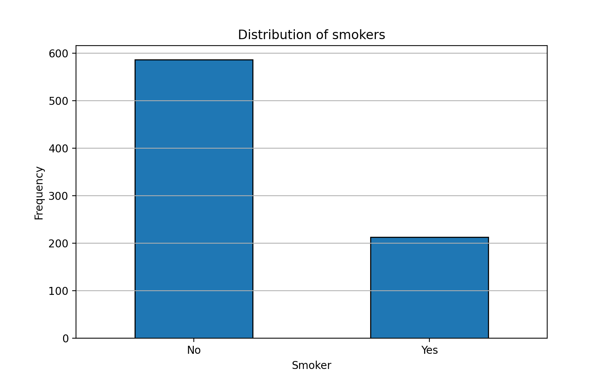
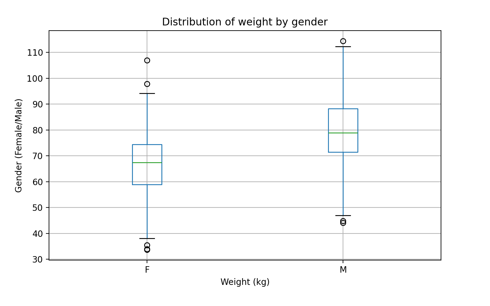
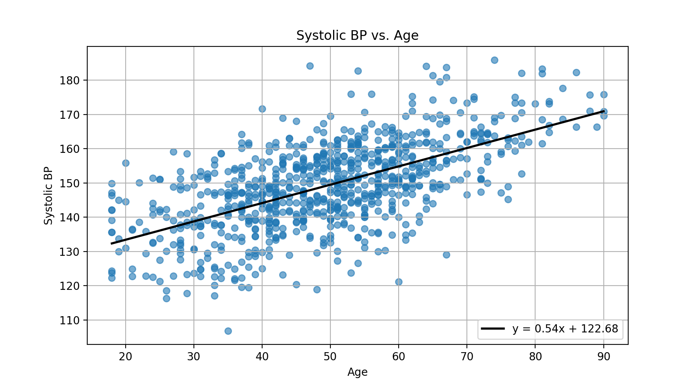
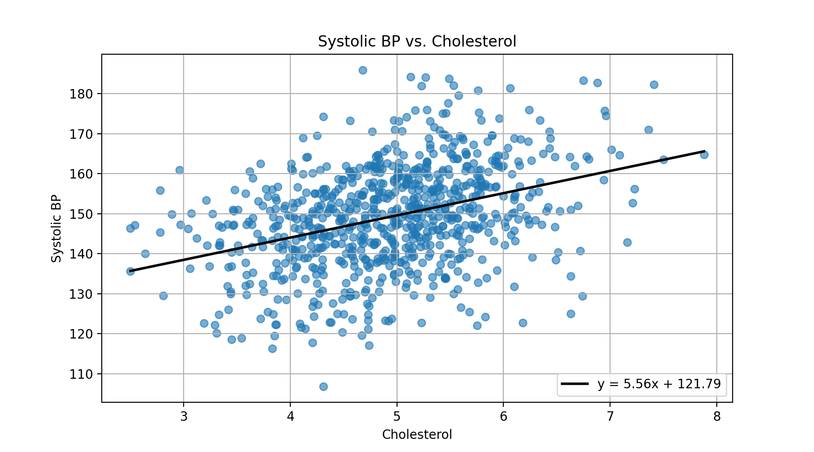

# Hälsostudie

## Rapport

### Figurer




### Konfidensintervall systoliskt bloodtryck
- **Medelvärde:** 149.18 mmHg
- **Konfidensintervall med t-fördelning:** (148.29, 150.07)
- **Konfidensintervall med bootstrap:** (148.30, 150.06)

### Hypotesprövning 
- Är genomsnitttligt bloodtryck hos rökare större än hos icke-rökare?
- Skillnad mellan medelvärden: 0.47
- p-värde: 0.326
- **Resultat:** Det finns inte tillräckligt med statistiskt stöd för att säga att blodtrycket är högre hos rökare än icke-rökare

### Regressionsanalys: Systoliskt bloodtryck och ålder
- Systoliskt bloodtryck ses öka med ålder, ca 0.54 mmHg per år.
- R²-värde: 37% så modellen har måttlig förklaringsgrad.
- 

### Regressionsanalys: Systoliskt bloodtryck och kolesterol
- Systoliskt bloodtryck ses när kolesterolvärdet ökar, ca 5.56 mmHg per 1 ökning i mmol/L.
- R²-värde: 14% så modellen har låg förklaringsgrad.
- 

### Multiple regression: Samband mellan systoliskt bloodtryck och kolesterol, ålder och vikt
- R²-värde: 40% så modellen har hög förklaringsgrad
- **Ålder:** koefficient 0.53, p-värde 0.00
- **Vikt:** koefficient 0.17, p-värde 0.00
- **Kolesterol:** koefficient 0.43, p-värde 0.385
- **Slutsats:** Ålder och vikt ses ha statistiskt signifikant påverkan på systoliskt bloodtryck. Kolesterol ses inte ha signifikant påverkan. 


## Miljö
- **Python:** 3.13.7
- **Paket:** `Pandas`, `matplotlib`, `numpy`, `statsmodel`, `scipy`, `sklearn` (se `requirements.txt`)

## Kom igång
```
# Klona projektet
git clone https://github.com/VeraStopp/individuell-uppgift-1.git

# Skapa och aktivera virituell miljö
python -m venv .venv
# Windows PowerShell
.venv\Scripts\Activate
# macOS/Linux
# source .venv/bin/activate

# Installera beroenden
python -m pip install -r requirements.txt
```